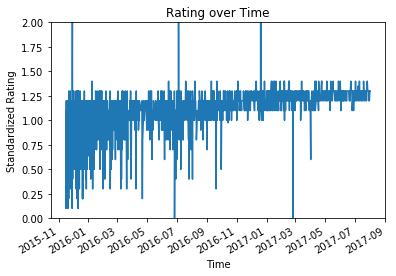

```python
# Import statements
import json
import matplotlib.pyplot as plt
import numpy as np
import os
import pandas as pd
import re
import requests
import seaborn as sns
import tweepy

from datetime import datetime
from functools import reduce

% matplotlib inline
```

# Gather


```python
# Load the enhanced twitter archive file we were given
twitter1 = pd.read_csv('twitter-archive-enhanced.csv')
```


```python
# Scrape the image predictions file from the Udacity website
url = 'https://d17h27t6h515a5.cloudfront.net/topher/2017/August/599fd2ad_image-predictions/image-predictions.tsv' 
response = requests.get(url)
with open(os.path.join('image_predictions.tsv'), mode = 'wb') as file:
    file.write(response.content)
```


```python
# Load the image predictions file
images = pd.read_csv('image_predictions.tsv', sep = '\t')
```


```python
# Setting up the Twitter API with authentication pieces
consumer_key = '...'
consumer_secret = '...'
access_token = '...'
access_secret = '...'

auth = tweepy.OAuthHandler(consumer_key, consumer_secret)
auth.set_access_token(access_token, access_secret)

api = tweepy.API(auth, parser=tweepy.parsers.JSONParser())
```


```python
# Use Twitter API to collect status data on tweets present in twitter1 dataframe
tweet_ids = list(twitter1['tweet_id'])

tweet_data = []
tweet_id_success = []
tweet_id_missing = []
for tweet_id in tweet_ids:
    try:
        data = api.get_status(tweet_id, 
                              tweet_mode='extended',
                              wait_on_rate_limit = True,
                              wait_on_rate_limit_notify = True)
        tweet_data.append(data)
        tweet_id_success.append(tweet_id)
    except:
        tweet_id_missing.append(tweet_id)
        print(tweet_id)
```

    888202515573088257
    873697596434513921
    869988702071779329
    866816280283807744
    861769973181624320
    845459076796616705
    842892208864923648
    837012587749474308
    827228250799742977
    802247111496568832
    775096608509886464


    Rate limit reached. Sleeping for: 658
    Rate limit reached. Sleeping for: 660


```python
# Write tweet data to json file
with open('tweet_json.txt', mode = 'w') as file:
    json.dump(tweet_data, file)
```


```python
# Load the Twitter API data
twitter2 = pd.read_json('tweet_json.txt')
twitter2['tweet_id'] = tweet_id_success
twitter2 = twitter2[['tweet_id', 'favorite_count', 'retweet_count']]
```

# Assess


```python
twitter1.sample(3)
```


<div>
<style scoped>
    .dataframe tbody tr th:only-of-type {
        vertical-align: middle;
    }

    .dataframe tbody tr th {
        vertical-align: top;
    }

    .dataframe thead th {
        text-align: right;
    }
</style>
<table border="1" class="dataframe">
  <thead>
    <tr style="text-align: right;">
      <th></th>
      <th>tweet_id</th>
      <th>in_reply_to_status_id</th>
      <th>in_reply_to_user_id</th>
      <th>timestamp</th>
      <th>source</th>
      <th>text</th>
      <th>retweeted_status_id</th>
      <th>retweeted_status_user_id</th>
      <th>retweeted_status_timestamp</th>
      <th>expanded_urls</th>
      <th>rating_numerator</th>
      <th>rating_denominator</th>
      <th>name</th>
      <th>doggo</th>
      <th>floofer</th>
      <th>pupper</th>
      <th>puppo</th>
    </tr>
  </thead>
  <tbody>
    <tr>
      <th>2251</th>
      <td>667806454573760512</td>
      <td>NaN</td>
      <td>NaN</td>
      <td>2015-11-20 20:47:20 +0000</td>
      <td>&lt;a href="http://twitter.com/download/iphone" r...</td>
      <td>This is Filup. He is overcome with joy after f...</td>
      <td>NaN</td>
      <td>NaN</td>
      <td>NaN</td>
      <td>https://twitter.com/dog_rates/status/667806454...</td>
      <td>10</td>
      <td>10</td>
      <td>Filup</td>
      <td>None</td>
      <td>None</td>
      <td>None</td>
      <td>None</td>
    </tr>
    <tr>
      <th>2179</th>
      <td>669006782128353280</td>
      <td>NaN</td>
      <td>NaN</td>
      <td>2015-11-24 04:17:01 +0000</td>
      <td>&lt;a href="http://twitter.com/download/iphone" r...</td>
      <td>This is Tucker. He is 100% ready for the sport...</td>
      <td>NaN</td>
      <td>NaN</td>
      <td>NaN</td>
      <td>https://twitter.com/dog_rates/status/669006782...</td>
      <td>12</td>
      <td>10</td>
      <td>Tucker</td>
      <td>None</td>
      <td>None</td>
      <td>None</td>
      <td>None</td>
    </tr>
    <tr>
      <th>232</th>
      <td>847962785489326080</td>
      <td>NaN</td>
      <td>NaN</td>
      <td>2017-04-01 00:04:17 +0000</td>
      <td>&lt;a href="http://twitter.com/download/iphone" r...</td>
      <td>This is Georgie. He's very shy. Only puppears ...</td>
      <td>NaN</td>
      <td>NaN</td>
      <td>NaN</td>
      <td>https://twitter.com/dog_rates/status/847962785...</td>
      <td>10</td>
      <td>10</td>
      <td>Georgie</td>
      <td>None</td>
      <td>None</td>
      <td>None</td>
      <td>None</td>
    </tr>
  </tbody>
</table>
</div>


```python
twitter1.info()
```

    <class 'pandas.core.frame.DataFrame'>
    RangeIndex: 2356 entries, 0 to 2355
    Data columns (total 17 columns):
    tweet_id                      2356 non-null int64
    in_reply_to_status_id         78 non-null float64
    in_reply_to_user_id           78 non-null float64
    timestamp                     2356 non-null object
    source                        2356 non-null object
    text                          2356 non-null object
    retweeted_status_id           181 non-null float64
    retweeted_status_user_id      181 non-null float64
    retweeted_status_timestamp    181 non-null object
    expanded_urls                 2297 non-null object
    rating_numerator              2356 non-null int64
    rating_denominator            2356 non-null int64
    name                          2356 non-null object
    doggo                         2356 non-null object
    floofer                       2356 non-null object
    pupper                        2356 non-null object
    puppo                         2356 non-null object
    dtypes: float64(4), int64(3), object(10)
    memory usage: 313.0+ KB


```python
twitter1['tweet_id'].value_counts()
```


    749075273010798592    1
    741099773336379392    1
    798644042770751489    1
    825120256414846976    1
    769212283578875904    1
    700462010979500032    1
    780858289093574656    1
    699775878809702401    1
    880095782870896641    1
    760521673607086080    1
    776477788987613185    1
    691820333922455552    1
    715696743237730304    1
    714606013974974464    1
    760539183865880579    1
    813157409116065792    1
    676430933382295552    1
    743510151680958465    1
    837012587749474308    1
    833722901757046785    1
    818259473185828864    1
    670704688707301377    1
    667160273090932737    1
    674394782723014656    1
    672082170312290304    1
    670093938074779648    1
    759923798737051648    1
    809920764300447744    1
    805487436403003392    1
    838085839343206401    1
                         ..
    763956972077010945    1
    870308999962521604    1
    720775346191278080    1
    785927819176054784    1
    783347506784731136    1
    775733305207554048    1
    834209720923721728    1
    825026590719483904    1
    758405701903519748    1
    668986018524233728    1
    690938899477221376    1
    667911425562669056    1
    754482103782404096    1
    713175907180089344    1
    669015743032369152    1
    672068090318987265    1
    816829038950027264    1
    683773439333797890    1
    674291837063053312    1
    837482249356513284    1
    767500508068192258    1
    773922284943896577    1
    673342308415348736    1
    886054160059072513    1
    748307329658011649    1
    715360349751484417    1
    666817836334096384    1
    794926597468000259    1
    673705679337693185    1
    700151421916807169    1
    Name: tweet_id, Length: 2356, dtype: int64


```python
twitter1['source'].value_counts()
```


    <a href="http://twitter.com/download/iphone" rel="nofollow">Twitter for iPhone</a>     2221
    <a href="http://vine.co" rel="nofollow">Vine - Make a Scene</a>                          91
    <a href="http://twitter.com" rel="nofollow">Twitter Web Client</a>                       33
    <a href="https://about.twitter.com/products/tweetdeck" rel="nofollow">TweetDeck</a>      11
    Name: source, dtype: int64


```python
twitter1['text'].value_counts()
```


    This is Lucy. She's sick of these bullshit generalizations 11/10 https://t.co/d2b5C2R0aO                                                                             1
    This is Crystal. She's flawless. Really wants to be a frat bro. 11/10 who does she even know here? https://t.co/WyqNFvEulG                                           1
    RT @Jenna_Marbles: @dog_rates Thanks for rating my cermets 14/10 wow I'm so proud I watered them so much                                                             1
    This is Tove. She's a Balsamic Poinsetter. Surprisingly deadly. 12/10 snug with caution https://t.co/t6RvnVEdRR                                                      1
    PUPDATE: I'm proud to announce that Toby is 236 days sober. Pupgraded to a 13/10. We're all very proud of you, Toby https://t.co/a5OaJeRl9B                          1
    Meet Snoop. His number one passion is sticking his head out of car windows, so he purchased some doggles. Stylish af. 13/10 happy travels https://t.co/iHYfZdz444    1
    Here we have some incredible doggos for #K9VeteransDay. All brave as h*ck. Salute your dog in solidarity. 14/10 for all https://t.co/SVNMdFqKDL                      1
    This is Pickles. She's a silly pupper. Thinks she's a dish. 12/10 would dry https://t.co/7mPCF4ZwEk                                                                  1
    Say hello to Sunny and Roxy. They pull things out of water together. 10/10 for both https://t.co/88aedAmxcl                                                          1
    *screeches for a sec and then faints* 12/10 https://t.co/N5QL4ySBEx                                                                                                  1
    This is Scooter. His lack of opposable thumbs is rendering his resistance to tickling embarrassingly moot. 12/10 would keep tickling https://t.co/F0VWg2GztI         1
    This is Tucker. He is 100% ready for the sports. 12/10 I would watch anything with him https://t.co/k0ddVUWTcu                                                       1
    This is Pancake. She loves Batman and winks like a h*ckin champ. 12/10 real crowd pleaser https://t.co/6kqsAjJNhi                                                    1
    This is Thumas. He covered himself in nanners for maximum camouflage. It didn't work. I can still see u Thumas. 9/10 https://t.co/x0ZDlNqfb1                         1
    Meet Hanz. He heard some thunder. 10/10 https://t.co/pKJK23j0QZ                                                                                                      1
    Meet Fillup. Spaghetti is his main weakness. Also pissed because he's rewarded with cat treats 11/10 it'll be ok pup https://t.co/TEHu55ZQKD                         1
    Here we have a well-established sunblockerspaniel. Lost his other flip-flop. 6/10 not very waterproof https://t.co/3RU6x0vHB7                                        1
    This is Meyer. He has to hold somebody's hand during car rides. He's also wearing a seatbelt. 12/10 responsible af https://t.co/WS6BoApYyL                           1
    I know it's tempting, but please stop sending in pics of Donald Trump. Thank you ...9/10 https://t.co/y35Y1TJERY                                                     1
    This is Terrenth. He just stubbed his toe. 10/10 deep breaths Terrenth https://t.co/Pg18CDFC7Z                                                                       1
    Super speedy pupper. Does not go gentle into that goodnight. 10/10 https://t.co/uPXBXS1XNb                                                                           1
    This is Daisy. She's puppears to be rare as all h*ck. Only seven like her currently domesticated. 13/10 pettable af https://t.co/meUc8jufAO                          1
    This is Beau. He's trying to keep his daddy from packing to leave for Annual Training. 13/10 and now I'm crying https://t.co/7JeDfQvzzI                              1
    Meet Vincent. He's a wild Adderall Cayenne. Shipped for free. Always fresh. Never frozen. 10/10 great purchase https://t.co/ZfS7chSsi7                               1
    Meet Zuzu. He just graduated college. Astute pupper. Needs 2 leashes to contain him. Wasn't ready for the pic. 10/10 https://t.co/2H5SKmk0k7                         1
    Say hello to Sadie and Daisy. They do all their shopping together. Can never agree on what to get. Like an old married pupple. Both 12/10 https://t.co/f5C5l5wa0e    1
    This is Ivar. She is a badass Viking warrior. Will sack your village. 10/10 savage af https://t.co/Dz6MiVssVU                                                        1
    This is Jerry. He's a Timbuk Slytherin. Eats his pizza from the side first. Crushed that cup with his bare paws 9/10 https://t.co/fvxHL6cRRs                         1
    This is Cassie. She goes door to door trying to find the owner of this baguette. No luck so far. 10/10 https://t.co/e8bj97CisO                                       1
    This is Herm. It's his first day of potty training. He's doing great. You got this Herm. 10/10 stellar pup https://t.co/gFl60yFJ0w                                   1
                                                                                                                                                                        ..
    @Jack_Septic_Eye I'd need a few more pics to polish a full analysis, but based on the good boy content above I'm leaning towards 12/10                               1
    Here we have a 1949 1st generation vulpix. Enjoys sweat tea and Fox News. Cannot be phased. 5/10 https://t.co/4B7cOc1EDq                                             1
    No no no this is all wrong. The Walmart had to have run into the dog driving the car. 10/10 someone tell him it's ok\nhttps://t.co/fRaTGcj68A                        1
    Again w the sharks guys. This week is about dogs ACTING or DRESSING like sharks. NOT actual sharks. Thank u ...11/10 https://t.co/Ie2mWXWjpr                         1
    Say hello to Oliver. He's pretty exotic. Fairly pupset as well. Too many midterms coming pup. 11/10 would pet with extreme caution https://t.co/fGAPAsxjKs           1
    This is Winnie. She lost her body saving a children's hospital from an avalanche. 13/10 what a h*ckin hero https://t.co/Tf0rh9ZgZe                                   1
    This is Jerry. He's a neat dog. No legs (tragic). Has more horns than a dog usually does. Bark is unique af. 5/10 https://t.co/85q7xlplsJ                            1
    This is Tuck. As you can see, he's rather h*ckin rare. Taken seriously until his legs are seen. Tail stuck in a permanent zoom. 13/10 https://t.co/P7PBGqrKSe        1
    "Hello yes could I get one pupper to go please thank you"\nBoth 13/10 https://t.co/kYWcXbluUu                                                                        1
    This pupper can only sleep on shoes. It's a crippling disease. Tearing his family apart. 12/10 I'd totally pet tho https://t.co/03XlvS8izg                           1
    *lets out a tiny screech and then goes into complete cardiac arrest* 12/10 https://t.co/az5PLGzVNJ                                                                   1
    With great pupper comes great responsibility. 12/10 https://t.co/hK6xB042EP                                                                                          1
    Meet Kollin. He's a Parakeetian Badminton from Denmark. Great artist. Taking break from research. Loves wicker 9/10 https://t.co/XPLB3eoXiX                          1
    This is Barry. He's very fast. I hope he finds what he's looking for. 10/10 (vid by @KeeganWolfe33) https://t.co/nTAsyvbIiO                                          1
    Meet Winston. He wants to be a power drill. Very focused. 10/10 I believe in you Winston https://t.co/exGrzT9O88                                                     1
    This is Iroh. He's in a predicament. 12/10 someone help him https://t.co/KJAKO2kXsL                                                                                  1
    This is Finley. He's an independent doggo still adjusting to life on his own. 11/10 https://t.co/7FNcBaKbci                                                          1
    C'mon guys. We've been over this. We only rate dogs. This is a cow. Please only submit dogs. Thank you...... 9/10 https://t.co/WjcELNEqN2                            1
    This is Evy. She doesn't want to be a Koala. 9/10 https://t.co/VITeF0Kl9L                                                                                            1
    When you see sophomores in high school driving. 11/10 https://t.co/m6aC8d1Kzp                                                                                        1
    Say hello to Lassie. She's celebrating #PrideMonth by being a splendid mix of astute and adorable. Proudly supupporting her owner. 13/10 https://t.co/uK6PNyeh9w     1
    This is Rascal. He's paddling an imaginary canoe. 11/10 https://t.co/Ajquq6oGSg                                                                                      1
    After getting lost in Reese's eyes for several minutes we're going to upgrade him to a 13/10                                                                         1
    Meet Snickers. He's adorable. Also comes in t-shirt mode. 12/10 I would aggressively caress Snickers https://t.co/aCRKDaFmVr                                         1
    This is Lola. She realized mid hug that she's not ready for a committed relationship with a teddy bear. 9/10 https://t.co/pVebzwRioD                                 1
    "I shall trip the big pupper with leash. Big pupper will never see it coming. I am a genius." Both 11/10 https://t.co/uQsCJ8pf51                                     1
    This is Chipson. He weighed in at .3 ounces and is officially super h*ckin smol. Space-saving af. 11/10 would snug delicately https://t.co/FjEsk7A1JV                1
    This is Hermione. Her face is as old as time. Appears fluffy af tho. 11/10 pretty damn majestic https://t.co/0b41Q4DKCA                                              1
    Say hello to Hall and Oates. Oates is winking and Hall is contemplating the artistic entropy of the universe. 11/10s https://t.co/n5Wtb5Hvsl                         1
    Meet Sojourner. His nose is a Fibonacci Spiral. Legendary af. 13/10 we must protect him at all costs https://t.co/r7W1NbkOtr                                         1
    Name: text, Length: 2356, dtype: int64


```python
twitter1['retweeted_status_id'].value_counts()
```


    7.757333e+17    1
    7.507196e+17    1
    6.742918e+17    1
    6.833919e+17    1
    8.269587e+17    1
    8.780576e+17    1
    7.320056e+17    1
    7.186315e+17    1
    6.732953e+17    1
    7.914070e+17    1
    8.447048e+17    1
    7.862340e+17    1
    8.685523e+17    1
    7.504293e+17    1
    8.327664e+17    1
    6.690004e+17    1
    6.873173e+17    1
    7.638376e+17    1
    7.815247e+17    1
    8.092201e+17    1
    8.000650e+17    1
    8.174239e+17    1
    8.001414e+17    1
    7.909461e+17    1
    7.867091e+17    1
    8.406323e+17    1
    8.688804e+17    1
    7.869631e+17    1
    7.733088e+17    1
    8.222448e+17    1
                   ..
    6.816941e+17    1
    7.899865e+17    1
    7.939622e+17    1
    6.800555e+17    1
    7.128090e+17    1
    8.164506e+17    1
    6.769365e+17    1
    6.675487e+17    1
    8.083449e+17    1
    7.626999e+17    1
    6.678667e+17    1
    8.479710e+17    1
    6.820881e+17    1
    8.352641e+17    1
    7.761133e+17    1
    7.902771e+17    1
    6.675484e+17    1
    7.677549e+17    1
    8.782815e+17    1
    8.663350e+17    1
    7.399792e+17    1
    7.403732e+17    1
    8.395493e+17    1
    7.001438e+17    1
    8.482894e+17    1
    7.848260e+17    1
    7.806013e+17    1
    8.305833e+17    1
    7.047611e+17    1
    7.331095e+17    1
    Name: retweeted_status_id, Length: 181, dtype: int64


```python
twitter1['retweeted_status_user_id'].value_counts()
```


    4.196984e+09    156
    4.296832e+09      2
    5.870972e+07      1
    6.669901e+07      1
    4.119842e+07      1
    7.475543e+17      1
    7.832140e+05      1
    7.266347e+08      1
    4.871977e+08      1
    5.970642e+08      1
    4.466750e+07      1
    1.228326e+09      1
    7.992370e+07      1
    2.488557e+07      1
    7.874618e+17      1
    3.638908e+08      1
    5.128045e+08      1
    8.117408e+08      1
    1.732729e+09      1
    1.960740e+07      1
    1.547674e+08      1
    3.410211e+08      1
    7.124572e+17      1
    2.804798e+08      1
    1.950368e+08      1
    Name: retweeted_status_user_id, dtype: int64


```python
twitter1['retweeted_status_timestamp'].value_counts()
```


    2016-03-21 19:29:52 +0000    1
    2016-08-11 20:40:41 +0000    1
    2016-11-22 20:58:07 +0000    1
    2016-11-09 00:37:46 +0000    1
    2015-11-16 04:02:55 +0000    1
    2016-02-18 02:24:13 +0000    1
    2017-05-05 18:36:06 +0000    1
    2016-06-08 02:41:38 +0000    1
    2017-01-11 02:15:36 +0000    1
    2015-12-08 18:17:56 +0000    1
    2016-02-02 23:52:22 +0000    1
    2017-05-18 01:17:25 +0000    1
    2016-08-15 16:22:20 +0000    1
    2016-11-01 03:00:09 +0000    1
    2017-01-14 17:00:24 +0000    1
    2015-12-28 17:12:42 +0000    1
    2017-05-02 00:04:57 +0000    1
    2015-12-11 16:40:19 +0000    1
    2017-01-07 20:18:46 +0000    1
    2017-04-20 18:14:33 +0000    1
    2017-01-27 17:04:02 +0000    1
    2015-12-24 00:58:27 +0000    1
    2017-02-16 23:23:38 +0000    1
    2015-12-24 16:00:30 +0000    1
    2016-09-26 17:55:00 +0000    1
    2017-05-21 16:48:45 +0000    1
    2016-09-25 00:06:08 +0000    1
    2017-02-14 23:43:18 +0000    1
    2017-01-06 17:33:29 +0000    1
    2015-11-20 01:06:48 +0000    1
                                ..
    2015-11-19 03:29:07 +0000    1
    2016-10-25 16:00:09 +0000    1
    2016-12-12 16:16:49 +0000    1
    2016-10-07 00:06:50 +0000    1
    2017-01-20 00:50:15 +0000    1
    2017-03-08 18:52:12 +0000    1
    2016-01-02 20:58:09 +0000    1
    2017-05-06 17:49:42 +0000    1
    2016-10-01 19:47:08 +0000    1
    2017-02-09 01:27:41 +0000    1
    2016-06-10 00:39:48 +0000    1
    2016-03-01 20:11:59 +0000    1
    2016-09-02 18:03:10 +0000    1
    2016-10-02 23:23:04 +0000    1
    2016-09-11 21:34:30 +0000    1
    2016-09-27 02:53:48 +0000    1
    2016-05-19 01:38:16 +0000    1
    2016-02-12 17:22:12 +0000    1
    2016-10-27 16:06:04 +0000    1
    2016-06-13 18:27:32 +0000    1
    2017-02-12 01:04:29 +0000    1
    2015-11-27 19:11:49 +0000    1
    2017-06-19 17:14:49 +0000    1
    2016-06-08 22:48:46 +0000    1
    2016-03-20 23:23:54 +0000    1
    2016-01-13 16:56:30 +0000    1
    2016-09-09 18:31:54 +0000    1
    2016-09-22 20:33:42 +0000    1
    2016-01-03 05:11:12 +0000    1
    2016-10-03 15:42:44 +0000    1
    Name: retweeted_status_timestamp, Length: 181, dtype: int64


```python
twitter1['expanded_urls'].value_counts()
```


    https://twitter.com/dog_rates/status/866450705531457537/photo/1,https://twitter.com/dog_rates/status/866450705531457537/photo/1                                                                                                                                                                        2
    https://twitter.com/dog_rates/status/866334964761202691/photo/1,https://twitter.com/dog_rates/status/866334964761202691/photo/1                                                                                                                                                                        2
    https://twitter.com/dog_rates/status/669000397445533696/photo/1                                                                                                                                                                                                                                        2
    https://twitter.com/dog_rates/status/816450570814898180/photo/1,https://twitter.com/dog_rates/status/816450570814898180/photo/1                                                                                                                                                                        2
    https://twitter.com/dog_rates/status/767754930266464257/photo/1                                                                                                                                                                                                                                        2
    https://www.gofundme.com/help-my-baby-sierra-get-better,https://twitter.com/dog_rates/status/873213775632977920/photo/1,https://twitter.com/dog_rates/status/873213775632977920/photo/1                                                                                                                2
    https://twitter.com/dog_rates/status/694669722378485760/photo/1,https://twitter.com/dog_rates/status/694669722378485760/photo/1                                                                                                                                                                        2
    https://www.gofundme.com/helpquinny,https://twitter.com/dog_rates/status/863062471531167744/photo/1,https://twitter.com/dog_rates/status/863062471531167744/photo/1,https://twitter.com/dog_rates/status/863062471531167744/photo/1,https://twitter.com/dog_rates/status/863062471531167744/photo/1    2
    https://www.gofundme.com/3ti3nps,https://twitter.com/dog_rates/status/868552278524837888/photo/1,https://twitter.com/dog_rates/status/868552278524837888/photo/1                                                                                                                                       2
    https://www.gofundme.com/lolas-life-saving-surgery-funds,https://twitter.com/dog_rates/status/835264098648616962/photo/1,https://twitter.com/dog_rates/status/835264098648616962/photo/1                                                                                                               2
    https://twitter.com/dog_rates/status/683391852557561860/photo/1                                                                                                                                                                                                                                        2
    https://twitter.com/dog_rates/status/676936541936185344/photo/1                                                                                                                                                                                                                                        2
    https://twitter.com/dog_rates/status/837820167694528512/photo/1,https://twitter.com/dog_rates/status/837820167694528512/photo/1                                                                                                                                                                        2
    https://twitter.com/dog_rates/status/820749716845686786/photo/1,https://twitter.com/dog_rates/status/820749716845686786/photo/1                                                                                                                                                                        2
    https://twitter.com/dog_rates/status/759923798737051648/photo/1                                                                                                                                                                                                                                        2
    https://twitter.com/dog_rates/status/829501995190984704/photo/1,https://twitter.com/dog_rates/status/829501995190984704/photo/1                                                                                                                                                                        2
    https://twitter.com/dog_rates/status/673295268553605120/photo/1                                                                                                                                                                                                                                        2
    https://twitter.com/dog_rates/status/819227688460238848/photo/1                                                                                                                                                                                                                                        2
    https://twitter.com/dog_rates/status/762699858130116608/photo/1                                                                                                                                                                                                                                        2
    https://twitter.com/dog_rates/status/783839966405230592/photo/1,https://twitter.com/dog_rates/status/783839966405230592/photo/1,https://twitter.com/dog_rates/status/783839966405230592/photo/1                                                                                                        2
    https://twitter.com/dog_rates/status/667182792070062081/photo/1                                                                                                                                                                                                                                        2
    https://twitter.com/dog_rates/status/782305867769217024/photo/1,https://twitter.com/dog_rates/status/782305867769217024/photo/1,https://twitter.com/dog_rates/status/782305867769217024/photo/1                                                                                                        2
    https://twitter.com/dog_rates/status/700747788515020802/photo/1                                                                                                                                                                                                                                        2
    https://twitter.com/dog_rates/status/786709082849828864/photo/1                                                                                                                                                                                                                                        2
    https://twitter.com/dog_rates/status/666104133288665088/photo/1                                                                                                                                                                                                                                        2
    https://www.gofundme.com/surgeryforjacktheminpin,https://twitter.com/dog_rates/status/815990720817401858/photo/1                                                                                                                                                                                       2
    https://twitter.com/dog_rates/status/762464539388485633/photo/1,https://twitter.com/dog_rates/status/762464539388485633/photo/1,https://twitter.com/dog_rates/status/762464539388485633/photo/1,https://twitter.com/dog_rates/status/762464539388485633/photo/1                                        2
    https://twitter.com/dog_rates/status/809220051211603969/photo/1,https://twitter.com/dog_rates/status/809220051211603969/photo/1                                                                                                                                                                        2
    https://www.gofundme.com/3yd6y1c,https://twitter.com/dog_rates/status/878281511006478336/photo/1                                                                                                                                                                                                       2
    https://twitter.com/dog_rates/status/740373189193256964/photo/1,https://twitter.com/dog_rates/status/740373189193256964/photo/1,https://twitter.com/dog_rates/status/740373189193256964/photo/1,https://twitter.com/dog_rates/status/740373189193256964/photo/1                                        2
                                                                                                                                                                                                                                                                                                          ..
    https://twitter.com/dog_rates/status/869596645499047938/photo/1,https://twitter.com/dog_rates/status/869596645499047938/photo/1                                                                                                                                                                        1
    https://twitter.com/nbcnews/status/866458718883467265                                                                                                                                                                                                                                                  1
    https://twitter.com/dog_rates/status/669367896104181761/photo/1                                                                                                                                                                                                                                        1
    https://twitter.com/dog_rates/status/673359818736984064/photo/1                                                                                                                                                                                                                                        1
    https://twitter.com/dog_rates/status/669353438988365824/photo/1                                                                                                                                                                                                                                        1
    https://twitter.com/dog_rates/status/668852170888998912/photo/1                                                                                                                                                                                                                                        1
    https://twitter.com/dog_rates/status/771136648247640064/photo/1                                                                                                                                                                                                                                        1
    https://twitter.com/dog_rates/status/780601303617732608/photo/1,https://twitter.com/dog_rates/status/780601303617732608/photo/1                                                                                                                                                                        1
    https://twitter.com/dog_rates/status/862096992088072192/photo/1,https://twitter.com/dog_rates/status/862096992088072192/photo/1                                                                                                                                                                        1
    https://twitter.com/dog_rates/status/693642232151285760/photo/1                                                                                                                                                                                                                                        1
    https://twitter.com/dog_rates/status/668537837512433665/photo/1                                                                                                                                                                                                                                        1
    https://twitter.com/dog_rates/status/671896809300709376/photo/1,https://twitter.com/dog_rates/status/671896809300709376/photo/1                                                                                                                                                                        1
    https://twitter.com/dog_rates/status/840268004936019968/photo/1,https://twitter.com/dog_rates/status/840268004936019968/photo/1,https://twitter.com/dog_rates/status/840268004936019968/photo/1,https://twitter.com/dog_rates/status/840268004936019968/photo/1                                        1
    https://twitter.com/dog_rates/status/823581115634085888/photo/1                                                                                                                                                                                                                                        1
    https://twitter.com/dog_rates/status/781955203444699136/photo/1                                                                                                                                                                                                                                        1
    https://twitter.com/dog_rates/status/671486386088865792/photo/1                                                                                                                                                                                                                                        1
    https://twitter.com/dog_rates/status/774757898236878852/photo/1                                                                                                                                                                                                                                        1
    https://twitter.com/dog_rates/status/673576835670777856/photo/1                                                                                                                                                                                                                                        1
    https://twitter.com/dog_rates/status/859074603037188101/photo/1                                                                                                                                                                                                                                        1
    https://twitter.com/dog_rates/status/672834301050937345/photo/1                                                                                                                                                                                                                                        1
    https://twitter.com/dog_rates/status/672614745925664768/photo/1                                                                                                                                                                                                                                        1
    https://twitter.com/dog_rates/status/728015554473250816/photo/1                                                                                                                                                                                                                                        1
    https://twitter.com/dog_rates/status/814153002265309185/photo/1                                                                                                                                                                                                                                        1
    https://twitter.com/dog_rates/status/672160042234327040/photo/1                                                                                                                                                                                                                                        1
    https://twitter.com/dog_rates/status/699323444782047232/photo/1                                                                                                                                                                                                                                        1
    https://twitter.com/dog_rates/status/743253157753532416/photo/1                                                                                                                                                                                                                                        1
    https://twitter.com/dog_rates/status/881268444196462592/photo/1                                                                                                                                                                                                                                        1
    https://twitter.com/dog_rates/status/668286279830867968/photo/1                                                                                                                                                                                                                                        1
    https://twitter.com/dog_rates/status/690649993829576704/photo/1                                                                                                                                                                                                                                        1
    https://twitter.com/dog_rates/status/749064354620928000/photo/1,https://twitter.com/dog_rates/status/749064354620928000/photo/1                                                                                                                                                                        1
    Name: expanded_urls, Length: 2218, dtype: int64


```python
twitter1['rating_numerator'].value_counts()
```


    12      558
    11      464
    10      461
    13      351
    9       158
    8       102
    7        55
    14       54
    5        37
    6        32
    3        19
    4        17
    1         9
    2         9
    420       2
    0         2
    15        2
    75        2
    80        1
    20        1
    24        1
    26        1
    44        1
    50        1
    60        1
    165       1
    84        1
    88        1
    144       1
    182       1
    143       1
    666       1
    960       1
    1776      1
    17        1
    27        1
    45        1
    99        1
    121       1
    204       1
    Name: rating_numerator, dtype: int64


```python
twitter1['rating_denominator'].value_counts()
```


    10     2333
    11        3
    50        3
    80        2
    20        2
    2         1
    16        1
    40        1
    70        1
    15        1
    90        1
    110       1
    120       1
    130       1
    150       1
    170       1
    7         1
    0         1
    Name: rating_denominator, dtype: int64


```python
twitter1['name'].value_counts()
```


    None        745
    a            55
    Charlie      12
    Cooper       11
    Lucy         11
    Oliver       11
    Lola         10
    Penny        10
    Tucker       10
    Bo            9
    Winston       9
    the           8
    Sadie         8
    Daisy         7
    Buddy         7
    Bailey        7
    Toby          7
    an            7
    Jax           6
    Rusty         6
    Jack          6
    Koda          6
    Stanley       6
    Bella         6
    Dave          6
    Scout         6
    Milo          6
    Leo           6
    Oscar         6
    Finn          5
               ... 
    Mason         1
    Binky         1
    Bode          1
    Gustav        1
    Dot           1
    Derby         1
    my            1
    Patch         1
    Edmund        1
    Mauve         1
    Beebop        1
    Tobi          1
    Brooks        1
    Hanz          1
    Jaycob        1
    Bert          1
    Ike           1
    Goliath       1
    Oddie         1
    Beemo         1
    Jersey        1
    Pumpkin       1
    Lizzie        1
    Hector        1
    Bertson       1
    Keet          1
    Robin         1
    Stefan        1
    Pete          1
    Philippe      1
    Name: name, Length: 957, dtype: int64


```python
twitter1['doggo'].value_counts()
```


    None     2259
    doggo      97
    Name: doggo, dtype: int64


```python
twitter1['floofer'].value_counts()
```


    None       2346
    floofer      10
    Name: floofer, dtype: int64


```python
twitter1['pupper'].value_counts()
```


    None      2099
    pupper     257
    Name: pupper, dtype: int64


```python
twitter1['puppo'].value_counts()
```


    None     2326
    puppo      30
    Name: puppo, dtype: int64


```python
twitter1.loc[twitter1['name'].str.isupper()]
```


<div>
<style scoped>
    .dataframe tbody tr th:only-of-type {
        vertical-align: middle;
    }

    .dataframe tbody tr th {
        vertical-align: top;
    }

    .dataframe thead th {
        text-align: right;
    }
</style>
<table border="1" class="dataframe">
  <thead>
    <tr style="text-align: right;">
      <th></th>
      <th>tweet_id</th>
      <th>in_reply_to_status_id</th>
      <th>in_reply_to_user_id</th>
      <th>timestamp</th>
      <th>source</th>
      <th>text</th>
      <th>retweeted_status_id</th>
      <th>retweeted_status_user_id</th>
      <th>retweeted_status_timestamp</th>
      <th>expanded_urls</th>
      <th>rating_numerator</th>
      <th>rating_denominator</th>
      <th>name</th>
      <th>doggo</th>
      <th>floofer</th>
      <th>pupper</th>
      <th>puppo</th>
    </tr>
  </thead>
  <tbody>
    <tr>
      <th>775</th>
      <td>776201521193218049</td>
      <td>NaN</td>
      <td>NaN</td>
      <td>2016-09-14 23:30:38 +0000</td>
      <td>&lt;a href="http://twitter.com/download/iphone" r...</td>
      <td>This is O'Malley. That is how he sleeps. Doesn...</td>
      <td>NaN</td>
      <td>NaN</td>
      <td>NaN</td>
      <td>https://twitter.com/dog_rates/status/776201521...</td>
      <td>10</td>
      <td>10</td>
      <td>O</td>
      <td>None</td>
      <td>None</td>
      <td>None</td>
      <td>None</td>
    </tr>
    <tr>
      <th>2041</th>
      <td>671542985629241344</td>
      <td>NaN</td>
      <td>NaN</td>
      <td>2015-12-01 04:14:59 +0000</td>
      <td>&lt;a href="http://twitter.com/download/iphone" r...</td>
      <td>This is JD (stands for "just dog"). He's like ...</td>
      <td>NaN</td>
      <td>NaN</td>
      <td>NaN</td>
      <td>https://twitter.com/dog_rates/status/671542985...</td>
      <td>10</td>
      <td>10</td>
      <td>JD</td>
      <td>None</td>
      <td>None</td>
      <td>None</td>
      <td>None</td>
    </tr>
  </tbody>
</table>
</div>


```python
twitter2.sample(5)
```


<div>
<style scoped>
    .dataframe tbody tr th:only-of-type {
        vertical-align: middle;
    }

    .dataframe tbody tr th {
        vertical-align: top;
    }

    .dataframe thead th {
        text-align: right;
    }
</style>
<table border="1" class="dataframe">
  <thead>
    <tr style="text-align: right;">
      <th></th>
      <th>tweet_id</th>
      <th>favorite_count</th>
      <th>retweet_count</th>
    </tr>
  </thead>
  <tbody>
    <tr>
      <th>1463</th>
      <td>693644216740769793</td>
      <td>1444</td>
      <td>142</td>
    </tr>
    <tr>
      <th>1615</th>
      <td>684800227459624960</td>
      <td>2917</td>
      <td>1092</td>
    </tr>
    <tr>
      <th>1418</th>
      <td>697596423848730625</td>
      <td>3256</td>
      <td>1385</td>
    </tr>
    <tr>
      <th>1239</th>
      <td>711008018775851008</td>
      <td>3208</td>
      <td>688</td>
    </tr>
    <tr>
      <th>1604</th>
      <td>685268753634967552</td>
      <td>3343</td>
      <td>1337</td>
    </tr>
  </tbody>
</table>
</div>


```python
twitter2.info()
```

    <class 'pandas.core.frame.DataFrame'>
    RangeIndex: 2345 entries, 0 to 2344
    Data columns (total 3 columns):
    tweet_id          2345 non-null int64
    favorite_count    2345 non-null int64
    retweet_count     2345 non-null int64
    dtypes: int64(3)
    memory usage: 55.0 KB


```python
twitter2['tweet_id'].value_counts()
```


    749075273010798592    1
    702321140488925184    1
    825120256414846976    1
    769212283578875904    1
    700462010979500032    1
    780858289093574656    1
    699775878809702401    1
    880095782870896641    1
    760521673607086080    1
    776477788987613185    1
    691820333922455552    1
    715696743237730304    1
    714606013974974464    1
    760539183865880579    1
    813157409116065792    1
    676430933382295552    1
    847251039262605312    1
    798644042770751489    1
    743510151680958465    1
    833722901757046785    1
    818259473185828864    1
    670704688707301377    1
    667160273090932737    1
    674394782723014656    1
    672082170312290304    1
    670093938074779648    1
    759923798737051648    1
    809920764300447744    1
    805487436403003392    1
    838085839343206401    1
                         ..
    720775346191278080    1
    879492040517615616    1
    785927819176054784    1
    834209720923721728    1
    857062103051644929    1
    825026590719483904    1
    758405701903519748    1
    668986018524233728    1
    690938899477221376    1
    678800283649069056    1
    681579835668455424    1
    693155686491000832    1
    667911425562669056    1
    816829038950027264    1
    886054160059072513    1
    683773439333797890    1
    674291837063053312    1
    837482249356513284    1
    767500508068192258    1
    669015743032369152    1
    773922284943896577    1
    748307329658011649    1
    783347506784731136    1
    715360349751484417    1
    666817836334096384    1
    794926597468000259    1
    673705679337693185    1
    673342308415348736    1
    754482103782404096    1
    700151421916807169    1
    Name: tweet_id, Length: 2345, dtype: int64


```python
twitter2['favorite_count'].value_counts()
```


    0        170
    2619       4
    513        4
    2011       3
    461        3
    2543       3
    2491       3
    550        3
    3153       3
    2822       3
    2934       3
    3399       3
    3231       2
    6971       2
    3539       2
    1027       2
    1580       2
    2273       2
    4396       2
    105        2
    2559       2
    7583       2
    450        2
    1761       2
    127        2
    340        2
    1444       2
    677        2
    2731       2
    673        2
            ... 
    2648       1
    8791       1
    35414      1
    2644       1
    12837      1
    37415      1
    8484       1
    4651       1
    27180      1
    8749       1
    14896      1
    16949      1
    2614       1
    37431      1
    2618       1
    82493      1
    2622       1
    4671       1
    6265       1
    8769       1
    2628       1
    8773       1
    4679       1
    585        1
    2634       1
    6732       1
    591        1
    6736       1
    2171       1
    24573      1
    Name: favorite_count, Length: 1993, dtype: int64


```python
twitter2['retweet_count'].value_counts()
```


    3819     5
    463      5
    528      4
    502      4
    241      4
    820      4
    592      4
    174      4
    94       4
    1857     4
    390      4
    509      4
    58       4
    1065     4
    815      4
    619      4
    254      4
    61       4
    5601     4
    81       3
    857      3
    358      3
    225      3
    251      3
    555      3
    675      3
    1060     3
    2873     3
    65       3
    730      3
            ..
    411      1
    413      1
    417      1
    419      1
    6568     1
    425      1
    4523     1
    369      1
    2416     1
    367      1
    14678    1
    321      1
    2370     1
    3137     1
    2372     1
    333      1
    6478     1
    4431     1
    341      1
    345      1
    2414     1
    2394     1
    351      1
    2400     1
    2402     1
    355      1
    361      1
    2410     1
    365      1
    0        1
    Name: retweet_count, Length: 1737, dtype: int64


```python
images.sample(5)
```


<div>
<style scoped>
    .dataframe tbody tr th:only-of-type {
        vertical-align: middle;
    }

    .dataframe tbody tr th {
        vertical-align: top;
    }

    .dataframe thead th {
        text-align: right;
    }
</style>
<table border="1" class="dataframe">
  <thead>
    <tr style="text-align: right;">
      <th></th>
      <th>tweet_id</th>
      <th>jpg_url</th>
      <th>img_num</th>
      <th>p1</th>
      <th>p1_conf</th>
      <th>p1_dog</th>
      <th>p2</th>
      <th>p2_conf</th>
      <th>p2_dog</th>
      <th>p3</th>
      <th>p3_conf</th>
      <th>p3_dog</th>
    </tr>
  </thead>
  <tbody>
    <tr>
      <th>750</th>
      <td>687826841265172480</td>
      <td>https://pbs.twimg.com/media/CYum3KbWEAArFrI.jpg</td>
      <td>1</td>
      <td>Pomeranian</td>
      <td>0.997210</td>
      <td>True</td>
      <td>Pekinese</td>
      <td>0.000803</td>
      <td>True</td>
      <td>keeshond</td>
      <td>0.000373</td>
      <td>True</td>
    </tr>
    <tr>
      <th>1528</th>
      <td>789137962068021249</td>
      <td>https://pbs.twimg.com/media/CvOUw8vWYAAzJDq.jpg</td>
      <td>2</td>
      <td>Chihuahua</td>
      <td>0.746135</td>
      <td>True</td>
      <td>Pekinese</td>
      <td>0.070383</td>
      <td>True</td>
      <td>Pembroke</td>
      <td>0.049237</td>
      <td>True</td>
    </tr>
    <tr>
      <th>588</th>
      <td>679111216690831360</td>
      <td>https://pbs.twimg.com/ext_tw_video_thumb/67911...</td>
      <td>1</td>
      <td>kelpie</td>
      <td>0.189423</td>
      <td>True</td>
      <td>beagle</td>
      <td>0.121988</td>
      <td>True</td>
      <td>basset</td>
      <td>0.121171</td>
      <td>True</td>
    </tr>
    <tr>
      <th>1191</th>
      <td>739932936087216128</td>
      <td>https://pbs.twimg.com/media/CkTFEe-W0AA90m1.jpg</td>
      <td>1</td>
      <td>redbone</td>
      <td>0.243904</td>
      <td>True</td>
      <td>beagle</td>
      <td>0.210975</td>
      <td>True</td>
      <td>vizsla</td>
      <td>0.076443</td>
      <td>True</td>
    </tr>
    <tr>
      <th>784</th>
      <td>690021994562220032</td>
      <td>https://pbs.twimg.com/media/CZNzV6cW0AAsX7p.jpg</td>
      <td>1</td>
      <td>badger</td>
      <td>0.289550</td>
      <td>False</td>
      <td>weasel</td>
      <td>0.099140</td>
      <td>False</td>
      <td>malamute</td>
      <td>0.040696</td>
      <td>True</td>
    </tr>
  </tbody>
</table>
</div>


```python
images.info()
```

    <class 'pandas.core.frame.DataFrame'>
    RangeIndex: 2075 entries, 0 to 2074
    Data columns (total 12 columns):
    tweet_id    2075 non-null int64
    jpg_url     2075 non-null object
    img_num     2075 non-null int64
    p1          2075 non-null object
    p1_conf     2075 non-null float64
    p1_dog      2075 non-null bool
    p2          2075 non-null object
    p2_conf     2075 non-null float64
    p2_dog      2075 non-null bool
    p3          2075 non-null object
    p3_conf     2075 non-null float64
    p3_dog      2075 non-null bool
    dtypes: bool(3), float64(3), int64(2), object(4)
    memory usage: 152.1+ KB


```python
images['tweet_id'].value_counts()
```


    685532292383666176    1
    826598365270007810    1
    692158366030913536    1
    714606013974974464    1
    715696743237730304    1
    776477788987613185    1
    772114945936949249    1
    699775878809702401    1
    780858289093574656    1
    700462010979500032    1
    732726085725589504    1
    738883359779196928    1
    798644042770751489    1
    743510151680958465    1
    837012587749474308    1
    833722901757046785    1
    668620235289837568    1
    842765311967449089    1
    685315239903100929    1
    673686845050527744    1
    680473011644985345    1
    666051853826850816    1
    675853064436391936    1
    693231807727280129    1
    705475953783398401    1
    829449946868879360    1
    759923798737051648    1
    667160273090932737    1
    680934982542561280    1
    743545585370791937    1
                         ..
    794926597468000259    1
    776113305656188928    1
    825026590719483904    1
    834209720923721728    1
    775733305207554048    1
    669564461267722241    1
    879492040517615616    1
    720775346191278080    1
    666362758909284353    1
    750506206503038976    1
    693155686491000832    1
    793601777308463104    1
    740373189193256964    1
    754482103782404096    1
    881536004380872706    1
    843604394117681152    1
    748307329658011649    1
    759846353224826880    1
    885984800019947520    1
    773922284943896577    1
    666345417576210432    1
    837482249356513284    1
    812781120811126785    1
    870804317367881728    1
    790698755171364864    1
    816829038950027264    1
    847971574464610304    1
    713175907180089344    1
    670338931251150849    1
    700151421916807169    1
    Name: tweet_id, Length: 2075, dtype: int64


```python
images['jpg_url'].value_counts()
```


    https://pbs.twimg.com/media/Cq9guJ5WgAADfpF.jpg                                            2
    https://pbs.twimg.com/media/Cveg1-NXgAASaaT.jpg                                            2
    https://pbs.twimg.com/media/CWza7kpWcAAdYLc.jpg                                            2
    https://pbs.twimg.com/media/CcG07BYW0AErrC9.jpg                                            2
    https://pbs.twimg.com/tweet_video_thumb/CeBym7oXEAEWbEg.jpg                                2
    https://pbs.twimg.com/media/Cwx99rpW8AMk_Ie.jpg                                            2
    https://pbs.twimg.com/media/C2kzTGxWEAEOpPL.jpg                                            2
    https://pbs.twimg.com/media/CkjMx99UoAM2B1a.jpg                                            2
    https://pbs.twimg.com/media/CdHwZd0VIAA4792.jpg                                            2
    https://pbs.twimg.com/media/CvoBPWRWgAA4het.jpg                                            2
    https://pbs.twimg.com/media/CiyHLocU4AI2pJu.jpg                                            2
    https://pbs.twimg.com/media/CtVAvX-WIAAcGTf.jpg                                            2
    https://pbs.twimg.com/ext_tw_video_thumb/817423809049493505/pu/img/5OFW0yueFu9oTUiQ.jpg    2
    https://pbs.twimg.com/media/CYLDikFWEAAIy1y.jpg                                            2
    https://pbs.twimg.com/media/Cp6db4-XYAAMmqL.jpg                                            2
    https://pbs.twimg.com/media/CmoPdmHW8AAi8BI.jpg                                            2
    https://pbs.twimg.com/ext_tw_video_thumb/675354114423808004/pu/img/qL1R_nGLqa6lmkOx.jpg    2
    https://pbs.twimg.com/media/CpmyNumW8AAAJGj.jpg                                            2
    https://pbs.twimg.com/media/CU3mITUWIAAfyQS.jpg                                            2
    https://pbs.twimg.com/media/CuRDF-XWcAIZSer.jpg                                            2
    https://pbs.twimg.com/media/CvyVxQRWEAAdSZS.jpg                                            2
    https://pbs.twimg.com/ext_tw_video_thumb/807106774843039744/pu/img/8XZg1xW35Xp2J6JW.jpg    2
    https://pbs.twimg.com/media/Ck2d7tJWUAEPTL3.jpg                                            2
    https://pbs.twimg.com/media/CZhn-QAWwAASQan.jpg                                            2
    https://pbs.twimg.com/media/Cx5R8wPVEAALa9r.jpg                                            2
    https://pbs.twimg.com/media/CVMOlMiWwAA4Yxl.jpg                                            2
    https://pbs.twimg.com/media/CU1zsMSUAAAS0qW.jpg                                            2
    https://pbs.twimg.com/media/CsVO7ljW8AAckRD.jpg                                            2
    https://pbs.twimg.com/media/CsrjryzWgAAZY00.jpg                                            2
    https://pbs.twimg.com/media/CrXhIqBW8AA6Bse.jpg                                            2
                                                                                              ..
    https://pbs.twimg.com/media/CUb6ebKWcAAJkd0.jpg                                            1
    https://pbs.twimg.com/media/Cp8k6oRWcAUL78U.jpg                                            1
    https://pbs.twimg.com/media/CWoyfMiWUAAmGdd.jpg                                            1
    https://pbs.twimg.com/media/CWzDWOkXAAAP0k7.jpg                                            1
    https://pbs.twimg.com/media/C_RAFTxUAAAbXjV.jpg                                            1
    https://pbs.twimg.com/media/CV6atgoWcAEsdv6.jpg                                            1
    https://pbs.twimg.com/media/CUxUSuaW4AAdQzv.jpg                                            1
    https://pbs.twimg.com/media/CT9lXGsUcAAyUFt.jpg                                            1
    https://pbs.twimg.com/media/CU3FbQgVAAACdCQ.jpg                                            1
    https://pbs.twimg.com/ext_tw_video_thumb/821407155391725568/pu/img/AJC07gFJDDBuwNTD.jpg    1
    https://pbs.twimg.com/media/CZlTVL4WkAEpVR5.jpg                                            1
    https://pbs.twimg.com/media/Ciqq-VFUUAANlWm.jpg                                            1
    https://pbs.twimg.com/media/Ccg02LiWEAAJHw1.jpg                                            1
    https://pbs.twimg.com/media/C_uG6eAUAAAvMvR.jpg                                            1
    https://pbs.twimg.com/media/CV4aqCwWsAIi3OP.jpg                                            1
    https://pbs.twimg.com/ext_tw_video_thumb/689289176076959744/pu/img/hEFkFtmMu_hkTlxK.jpg    1
    https://pbs.twimg.com/media/CoQKNY7XYAE_cuX.jpg                                            1
    https://pbs.twimg.com/media/C_kBjuUUIAArs2-.jpg                                            1
    https://pbs.twimg.com/media/CcHWqQCW8AEb0ZH.jpg                                            1
    https://pbs.twimg.com/media/C5EdT4jWEAARv2C.jpg                                            1
    https://pbs.twimg.com/media/CmS-QkQWAAAkUa-.jpg                                            1
    https://pbs.twimg.com/media/CfjE5FRXEAErFWR.jpg                                            1
    https://pbs.twimg.com/media/CsKmMB2WAAAXcAy.jpg                                            1
    https://pbs.twimg.com/media/CUEUva1WsAA2jPb.jpg                                            1
    https://pbs.twimg.com/media/C1Q17WdWEAAjKFO.jpg                                            1
    https://pbs.twimg.com/media/Cvi2FiKWgAAif1u.jpg                                            1
    https://pbs.twimg.com/ext_tw_video_thumb/751250895690731520/pu/img/eziHbU1KbgZg-ijN.jpg    1
    https://pbs.twimg.com/media/C4qv3JUW8AADirb.jpg                                            1
    https://pbs.twimg.com/media/CUxzQ-nWIAAgJUm.jpg                                            1
    https://pbs.twimg.com/media/DEoH3yvXgAAzQtS.jpg                                            1
    Name: jpg_url, Length: 2009, dtype: int64


```python
images['img_num'].value_counts()
```


    1    1780
    2     198
    3      66
    4      31
    Name: img_num, dtype: int64


```python
images['p1'].value_counts()
```


    golden_retriever             150
    Labrador_retriever           100
    Pembroke                      89
    Chihuahua                     83
    pug                           57
    chow                          44
    Samoyed                       43
    toy_poodle                    39
    Pomeranian                    38
    malamute                      30
    cocker_spaniel                30
    French_bulldog                26
    Chesapeake_Bay_retriever      23
    miniature_pinscher            23
    seat_belt                     22
    Staffordshire_bullterrier     20
    Siberian_husky                20
    German_shepherd               20
    web_site                      19
    Cardigan                      19
    Eskimo_dog                    18
    Shetland_sheepdog             18
    beagle                        18
    teddy                         18
    Maltese_dog                   18
    Rottweiler                    17
    Shih-Tzu                      17
    Lakeland_terrier              17
    kuvasz                        16
    Italian_greyhound             16
                                ... 
    syringe                        1
    wild_boar                      1
    beaver                         1
    bonnet                         1
    lawn_mower                     1
    cup                            1
    timber_wolf                    1
    lion                           1
    polecat                        1
    damselfly                      1
    clumber                        1
    bald_eagle                     1
    envelope                       1
    hummingbird                    1
    pitcher                        1
    leopard                        1
    banana                         1
    skunk                          1
    quilt                          1
    Japanese_spaniel               1
    zebra                          1
    pole                           1
    carousel                       1
    dhole                          1
    canoe                          1
    Egyptian_cat                   1
    sundial                        1
    terrapin                       1
    boathouse                      1
    handkerchief                   1
    Name: p1, Length: 378, dtype: int64


```python
images['p1_conf'].value_counts()
```


    0.366248    2
    0.713293    2
    0.375098    2
    0.636169    2
    0.611525    2
    0.420463    2
    0.581403    2
    0.403698    2
    0.530104    2
    0.254856    2
    0.346545    2
    0.721188    2
    0.677408    2
    0.907083    2
    0.243529    2
    0.505370    2
    0.593858    2
    0.372202    2
    0.274637    2
    0.600276    2
    0.506312    2
    0.615163    2
    0.556595    2
    0.995143    2
    0.809197    2
    0.964929    2
    0.777468    2
    0.336200    2
    0.617389    2
    0.786089    2
               ..
    0.483228    1
    0.556524    1
    0.176423    1
    0.318981    1
    0.733025    1
    0.730152    1
    0.436023    1
    0.479008    1
    0.162935    1
    0.897162    1
    0.320420    1
    0.999833    1
    0.995873    1
    0.523206    1
    0.942911    1
    0.537652    1
    0.672791    1
    0.952258    1
    0.855959    1
    0.665578    1
    0.841265    1
    0.668164    1
    0.946828    1
    0.714719    1
    0.352946    1
    0.713102    1
    0.765266    1
    0.491022    1
    0.905334    1
    1.000000    1
    Name: p1_conf, Length: 2006, dtype: int64


```python
images['p1_dog'].value_counts()
```


    True     1532
    False     543
    Name: p1_dog, dtype: int64


```python
images['p2'].value_counts()
```


    Labrador_retriever                104
    golden_retriever                   92
    Cardigan                           73
    Chihuahua                          44
    Pomeranian                         42
    Chesapeake_Bay_retriever           41
    French_bulldog                     41
    toy_poodle                         37
    cocker_spaniel                     34
    miniature_poodle                   33
    Siberian_husky                     33
    beagle                             28
    Eskimo_dog                         27
    collie                             27
    Pembroke                           27
    kuvasz                             26
    Italian_greyhound                  22
    Pekinese                           21
    American_Staffordshire_terrier     21
    chow                               20
    malinois                           20
    Samoyed                            20
    toy_terrier                        20
    miniature_pinscher                 20
    Norwegian_elkhound                 19
    Boston_bull                        19
    Staffordshire_bullterrier          18
    Irish_terrier                      17
    pug                                17
    Shih-Tzu                           16
                                     ... 
    toaster                             1
    polecat                             1
    snail                               1
    lifeboat                            1
    television                          1
    coral_fungus                        1
    apron                               1
    ashcan                              1
    snorkel                             1
    bagel                               1
    paper_towel                         1
    dumbbell                            1
    sombrero                            1
    chain_mail                          1
    bobsled                             1
    cougar                              1
    tiger                               1
    hatchet                             1
    sunglass                            1
    grey_whale                          1
    coral_reef                          1
    umbrella                            1
    bearskin                            1
    tarantula                           1
    desk                                1
    cornet                              1
    patio                               1
    Gila_monster                        1
    peacock                             1
    handkerchief                        1
    Name: p2, Length: 405, dtype: int64


```python
images['p2_conf'].value_counts()
```


    0.069362    3
    0.027907    2
    0.193654    2
    0.271929    2
    0.003143    2
    0.197021    2
    0.347609    2
    0.151047    2
    0.052724    2
    0.153126    2
    0.119256    2
    0.227150    2
    0.057091    2
    0.149950    2
    0.025119    2
    0.165930    2
    0.190503    2
    0.012763    2
    0.181351    2
    0.325106    2
    0.020089    2
    0.172844    2
    0.142204    2
    0.152445    2
    0.052956    2
    0.099984    2
    0.093940    2
    0.252706    2
    0.140798    2
    0.130611    2
               ..
    0.083513    1
    0.100988    1
    0.038062    1
    0.317368    1
    0.256433    1
    0.057883    1
    0.098354    1
    0.250014    1
    0.088474    1
    0.178088    1
    0.053008    1
    0.052396    1
    0.165655    1
    0.182538    1
    0.074962    1
    0.120530    1
    0.169758    1
    0.119745    1
    0.090938    1
    0.071665    1
    0.139346    1
    0.036575    1
    0.073101    1
    0.118181    1
    0.000077    1
    0.138331    1
    0.254884    1
    0.090644    1
    0.219323    1
    0.016301    1
    Name: p2_conf, Length: 2004, dtype: int64


```python
images['p2_dog'].value_counts()
```


    True     1553
    False     522
    Name: p2_dog, dtype: int64


```python
images['p3'].value_counts()
```


    Labrador_retriever                79
    Chihuahua                         58
    golden_retriever                  48
    Eskimo_dog                        38
    kelpie                            35
    kuvasz                            34
    chow                              32
    Staffordshire_bullterrier         32
    beagle                            31
    cocker_spaniel                    31
    Pomeranian                        29
    Pekinese                          29
    toy_poodle                        29
    Pembroke                          27
    Great_Pyrenees                    27
    Chesapeake_Bay_retriever          27
    French_bulldog                    26
    malamute                          26
    American_Staffordshire_terrier    24
    pug                               23
    Cardigan                          23
    basenji                           21
    toy_terrier                       20
    bull_mastiff                      20
    Siberian_husky                    19
    Boston_bull                       17
    Shetland_sheepdog                 17
    Lakeland_terrier                  16
    boxer                             16
    doormat                           16
                                      ..
    loupe                              1
    nipple                             1
    barbell                            1
    balance_beam                       1
    pool_table                         1
    whiptail                           1
    binder                             1
    hatchet                            1
    sunglass                           1
    drumstick                          1
    wing                               1
    coral_reef                         1
    lion                               1
    barber_chair                       1
    park_bench                         1
    hare                               1
    cliff                              1
    bulletproof_vest                   1
    hammerhead                         1
    swimming_trunks                    1
    black_swan                         1
    panpipe                            1
    broccoli                           1
    bannister                          1
    joystick                           1
    cloak                              1
    chest                              1
    switch                             1
    shovel                             1
    parachute                          1
    Name: p3, Length: 408, dtype: int64


```python
images['p3_conf'].value_counts()
```


    0.094759    2
    0.035711    2
    0.000428    2
    0.044660    2
    0.162084    2
    0.077130    2
    0.116806    2
    0.146427    2
    0.003956    2
    0.039012    2
    0.137186    2
    0.109677    2
    0.096435    2
    0.157028    2
    0.157524    2
    0.118199    2
    0.016497    2
    0.100842    2
    0.151024    2
    0.005410    2
    0.026364    2
    0.186789    2
    0.223263    2
    0.087355    2
    0.121523    2
    0.041476    2
    0.071436    2
    0.046403    2
    0.014858    2
    0.003330    2
               ..
    0.098207    1
    0.013206    1
    0.106014    1
    0.044002    1
    0.127037    1
    0.001404    1
    0.001274    1
    0.008451    1
    0.039808    1
    0.056548    1
    0.001310    1
    0.016663    1
    0.079883    1
    0.122701    1
    0.047397    1
    0.068297    1
    0.031673    1
    0.047601    1
    0.019516    1
    0.051835    1
    0.078720    1
    0.143328    1
    0.000436    1
    0.003383    1
    0.109454    1
    0.024007    1
    0.132820    1
    0.002099    1
    0.083643    1
    0.033835    1
    Name: p3_conf, Length: 2006, dtype: int64


```python
images['p3_dog'].value_counts()
```


    True     1499
    False     576
    Name: p3_dog, dtype: int64


### Quality Issues (not all issues will be cleaned)

#### twitter1 dataframe
* Data contains retweets (ie. rows where retweeted_status_id and retweeted_status_user_id have a number instead of NaN)
* tweet_id is an integer
* timestamp and retweeted_status_timestamp are currently of type 'object'
* source is in HTML format with a and \a tags surrounding the text
* name has values that are the string "None" instead of NaN
* Looking programmatically, some names are inaccurate such as "a", "an", "the", "very", "by", etc.  Looking visually in Excel, I was able to find more names that are inaccurate including "actually", "quite", "unacceptable", "mad", "not" and "old.  It seems like the method used to extract the names was using the word the followed "This is..." and "Here is..." which leads to some inaccuracies.
* Found an instance of a name being "O" instead of "O'Malley"
* doggo, floofer, pupper, and puppo have values that are the string "None" instead of NaN
* Upon visual inspection in Excel, there are ratings that are incorrect.  I ordered the ratings from low to high and looked at the extremes only for incorrect ratings therefore there are likely more than I missed and will be difficult to find them all programmatically.  Examples where things may have gone wrong is the use of decimals, or when two instances of numbers separated by a slash are present in 1 text and I assume the first was chosen.  Also, there are ratings with decimals such as 13.5/10, 9.5/10 have been incorrectly extracted as 5/10 (in addition to other numbers with decimals such as 11.26 and 11.27).  There are instances of 1/2 and 50/50 which are not ratings such signifying "half" which have been considered as ratings. Finally, use of 4/20 and 24/7 has been confused as ratings. 
* For future analysis it could be confusing to interpret unstandardized ratings.  It is their gimmick to give dogs a rating of 100% but not all are above 100% so it could be interesting to see what % are below or above 100% and how this changed overtime by calculating a single value for rating.
* There are many columns in this dataframe making it hard to read, and some will not be needed for analysis

#### twitter2 dataframe
* There are 11 missing tweets compared to the twitter1 datagrame (I am assuming they have been deleted)

#### images dataframe
* There are 2356 tweets in the twitter1 dataframe and 2075 rows in the images dataframe.  This could mean that there is missing data, or that not all 2356 of the tweets had pictures. 
* tweet_id is an integer
* p1, p2, and p3 contain underscores instead of spaces in the labels


### Tidiness Issues

#### twitter1 dataframe
* 1 variable (dog stage) in 4 different columns (doggo, floofer, pupper, and puppo)

#### twitter2 dataframe
* twitter2 data should be combined with the twitter1 data since they are information about the same tweet

#### images dataframe
* images data could be combined with the twitter1 data as well since it is all information about 1 tweet


# Clean


```python
# Make copies of the dataframes for cleaning

twitter1_clean = twitter1.copy()
twitter2_clean = twitter2.copy()
images_clean = images.copy()
```

## Tidiness issue 1 - Merge all dataframes

### Define

**Issue**: twitter2 and images data should be combined with the twitter1 data since they are information about the same tweet
<br>**Solution**: Merge the 3 datasets together on 'tweet_id' using the reduce function.

### Code


```python
# Merge the twitter1, twitter2, and images dataframes on 'tweet_id'
dfs = [twitter1_clean, twitter2_clean, images_clean]
twitter = reduce(lambda left,right: pd.merge(left,right,on='tweet_id'), dfs)
```

### Test


```python
# View first few lines of new twitter dataframe to ensure the columns have merged
twitter.head(2)
```


<div>
<style scoped>
    .dataframe tbody tr th:only-of-type {
        vertical-align: middle;
    }

    .dataframe tbody tr th {
        vertical-align: top;
    }

    .dataframe thead th {
        text-align: right;
    }
</style>
<table border="1" class="dataframe">
  <thead>
    <tr style="text-align: right;">
      <th></th>
      <th>tweet_id</th>
      <th>in_reply_to_status_id</th>
      <th>in_reply_to_user_id</th>
      <th>timestamp</th>
      <th>source</th>
      <th>text</th>
      <th>retweeted_status_id</th>
      <th>retweeted_status_user_id</th>
      <th>retweeted_status_timestamp</th>
      <th>expanded_urls</th>
      <th>...</th>
      <th>img_num</th>
      <th>p1</th>
      <th>p1_conf</th>
      <th>p1_dog</th>
      <th>p2</th>
      <th>p2_conf</th>
      <th>p2_dog</th>
      <th>p3</th>
      <th>p3_conf</th>
      <th>p3_dog</th>
    </tr>
  </thead>
  <tbody>
    <tr>
      <th>0</th>
      <td>892420643555336193</td>
      <td>NaN</td>
      <td>NaN</td>
      <td>2017-08-01 16:23:56 +0000</td>
      <td>&lt;a href="http://twitter.com/download/iphone" r...</td>
      <td>This is Phineas. He's a mystical boy. Only eve...</td>
      <td>NaN</td>
      <td>NaN</td>
      <td>NaN</td>
      <td>https://twitter.com/dog_rates/status/892420643...</td>
      <td>...</td>
      <td>1</td>
      <td>orange</td>
      <td>0.097049</td>
      <td>False</td>
      <td>bagel</td>
      <td>0.085851</td>
      <td>False</td>
      <td>banana</td>
      <td>0.076110</td>
      <td>False</td>
    </tr>
    <tr>
      <th>1</th>
      <td>892177421306343426</td>
      <td>NaN</td>
      <td>NaN</td>
      <td>2017-08-01 00:17:27 +0000</td>
      <td>&lt;a href="http://twitter.com/download/iphone" r...</td>
      <td>This is Tilly. She's just checking pup on you....</td>
      <td>NaN</td>
      <td>NaN</td>
      <td>NaN</td>
      <td>https://twitter.com/dog_rates/status/892177421...</td>
      <td>...</td>
      <td>1</td>
      <td>Chihuahua</td>
      <td>0.323581</td>
      <td>True</td>
      <td>Pekinese</td>
      <td>0.090647</td>
      <td>True</td>
      <td>papillon</td>
      <td>0.068957</td>
      <td>True</td>
    </tr>
  </tbody>
</table>
<p>2 rows × 30 columns</p>
</div>


```python
# View info of new twitter dataframe to ensure the columns have merged
twitter.info()
```

    <class 'pandas.core.frame.DataFrame'>
    Int64Index: 2069 entries, 0 to 2068
    Data columns (total 30 columns):
    tweet_id                      2069 non-null int64
    in_reply_to_status_id         23 non-null float64
    in_reply_to_user_id           23 non-null float64
    timestamp                     2069 non-null object
    source                        2069 non-null object
    text                          2069 non-null object
    retweeted_status_id           75 non-null float64
    retweeted_status_user_id      75 non-null float64
    retweeted_status_timestamp    75 non-null object
    expanded_urls                 2069 non-null object
    rating_numerator              2069 non-null int64
    rating_denominator            2069 non-null int64
    name                          2069 non-null object
    doggo                         2069 non-null object
    floofer                       2069 non-null object
    pupper                        2069 non-null object
    puppo                         2069 non-null object
    favorite_count                2069 non-null int64
    retweet_count                 2069 non-null int64
    jpg_url                       2069 non-null object
    img_num                       2069 non-null int64
    p1                            2069 non-null object
    p1_conf                       2069 non-null float64
    p1_dog                        2069 non-null bool
    p2                            2069 non-null object
    p2_conf                       2069 non-null float64
    p2_dog                        2069 non-null bool
    p3                            2069 non-null object
    p3_conf                       2069 non-null float64
    p3_dog                        2069 non-null bool
    dtypes: bool(3), float64(7), int64(6), object(14)
    memory usage: 458.7+ KB


## Tidiness issue 2 - One column for dog stages

### Define

**Issue**: 1 variable (dog stage) in 4 different columns (doggo, floofer, pupper, and puppo)
<br>**Solution**: Extract the dog stages from the 'text' column into the new 'dog_stage' column using regular expression then drop the 'doggo', 'floofer', 'pupper', and 'puppo' columns.  This also takes care of the quality issue of "name has values that are the string "None" instead of NaN".  

### Code


```python
# Extract dog stages from 'text' column into new 'dog_stage' column 
twitter['dog_stage'] = twitter['text'].str.extract('(doggo|floofer|pupper|puppo)')
```

    C:\Users\ursula\Anaconda3\lib\site-packages\ipykernel_launcher.py:2: FutureWarning: currently extract(expand=None) means expand=False (return Index/Series/DataFrame) but in a future version of pandas this will be changed to expand=True (return DataFrame)
      


```python
# Check that first few instances of dog_stage are similar 
# to that which was previously extracted
twitter[['dog_stage','doggo', 'floofer', 'pupper', 'puppo']].head(15)
```


<div>
<style scoped>
    .dataframe tbody tr th:only-of-type {
        vertical-align: middle;
    }

    .dataframe tbody tr th {
        vertical-align: top;
    }

    .dataframe thead th {
        text-align: right;
    }
</style>
<table border="1" class="dataframe">
  <thead>
    <tr style="text-align: right;">
      <th></th>
      <th>dog_stage</th>
      <th>doggo</th>
      <th>floofer</th>
      <th>pupper</th>
      <th>puppo</th>
    </tr>
  </thead>
  <tbody>
    <tr>
      <th>0</th>
      <td>NaN</td>
      <td>None</td>
      <td>None</td>
      <td>None</td>
      <td>None</td>
    </tr>
    <tr>
      <th>1</th>
      <td>NaN</td>
      <td>None</td>
      <td>None</td>
      <td>None</td>
      <td>None</td>
    </tr>
    <tr>
      <th>2</th>
      <td>NaN</td>
      <td>None</td>
      <td>None</td>
      <td>None</td>
      <td>None</td>
    </tr>
    <tr>
      <th>3</th>
      <td>NaN</td>
      <td>None</td>
      <td>None</td>
      <td>None</td>
      <td>None</td>
    </tr>
    <tr>
      <th>4</th>
      <td>NaN</td>
      <td>None</td>
      <td>None</td>
      <td>None</td>
      <td>None</td>
    </tr>
    <tr>
      <th>5</th>
      <td>NaN</td>
      <td>None</td>
      <td>None</td>
      <td>None</td>
      <td>None</td>
    </tr>
    <tr>
      <th>6</th>
      <td>NaN</td>
      <td>None</td>
      <td>None</td>
      <td>None</td>
      <td>None</td>
    </tr>
    <tr>
      <th>7</th>
      <td>NaN</td>
      <td>None</td>
      <td>None</td>
      <td>None</td>
      <td>None</td>
    </tr>
    <tr>
      <th>8</th>
      <td>NaN</td>
      <td>None</td>
      <td>None</td>
      <td>None</td>
      <td>None</td>
    </tr>
    <tr>
      <th>9</th>
      <td>doggo</td>
      <td>doggo</td>
      <td>None</td>
      <td>None</td>
      <td>None</td>
    </tr>
    <tr>
      <th>10</th>
      <td>NaN</td>
      <td>None</td>
      <td>None</td>
      <td>None</td>
      <td>None</td>
    </tr>
    <tr>
      <th>11</th>
      <td>NaN</td>
      <td>None</td>
      <td>None</td>
      <td>None</td>
      <td>None</td>
    </tr>
    <tr>
      <th>12</th>
      <td>puppo</td>
      <td>None</td>
      <td>None</td>
      <td>None</td>
      <td>puppo</td>
    </tr>
    <tr>
      <th>13</th>
      <td>NaN</td>
      <td>None</td>
      <td>None</td>
      <td>None</td>
      <td>None</td>
    </tr>
    <tr>
      <th>14</th>
      <td>puppo</td>
      <td>None</td>
      <td>None</td>
      <td>None</td>
      <td>puppo</td>
    </tr>
  </tbody>
</table>
</div>


```python
# Drop doggo, floofer, pupper, and puppo columns
twitter = twitter.drop(['doggo', 'floofer', 'pupper', 'puppo'], axis=1)
```

### Test


```python
# Check for presence of 'dog_stage" and absence of 'doggo', 'floofer', 
# 'pupper', and 'puppo'
twitter.info()
```

    <class 'pandas.core.frame.DataFrame'>
    Int64Index: 2069 entries, 0 to 2068
    Data columns (total 27 columns):
    tweet_id                      2069 non-null int64
    in_reply_to_status_id         23 non-null float64
    in_reply_to_user_id           23 non-null float64
    timestamp                     2069 non-null object
    source                        2069 non-null object
    text                          2069 non-null object
    retweeted_status_id           75 non-null float64
    retweeted_status_user_id      75 non-null float64
    retweeted_status_timestamp    75 non-null object
    expanded_urls                 2069 non-null object
    rating_numerator              2069 non-null int64
    rating_denominator            2069 non-null int64
    name                          2069 non-null object
    favorite_count                2069 non-null int64
    retweet_count                 2069 non-null int64
    jpg_url                       2069 non-null object
    img_num                       2069 non-null int64
    p1                            2069 non-null object
    p1_conf                       2069 non-null float64
    p1_dog                        2069 non-null bool
    p2                            2069 non-null object
    p2_conf                       2069 non-null float64
    p2_dog                        2069 non-null bool
    p3                            2069 non-null object
    p3_conf                       2069 non-null float64
    p3_dog                        2069 non-null bool
    dog_stage                     338 non-null object
    dtypes: bool(3), float64(7), int64(6), object(11)
    memory usage: 410.2+ KB


## Quality issue 1 - Remove retweets

### Define

**Issue**: Data contains retweets
<br>**Solution**: Rows where 'retweeted_status_id' is a NaN will be kept (ie. if it has a value it will be removed), then the 'retweeted_status_id', 'retweeted_status_user_id' and 'retweeted_status_timestamp' columns will be removed.  

### Code


```python
# Keep columns where 'retweeted_status_id' is NaN
twitter = twitter[np.isnan(twitter.retweeted_status_id)]

# Check info to determine all there are no non-null entries for
# 'retweeted_status_id', 'retweeted_status_user_id' and 
# 'retweeted_status_timestamp'
print(twitter.info())

# Remove 'retweeted_status_id', 'retweeted_status_user_id' and 
# 'retweeted_status_timestamp' columns
twitter = twitter.drop(['retweeted_status_id', 
                        'retweeted_status_user_id', 
                        'retweeted_status_timestamp'], 
                       axis=1)
```

    <class 'pandas.core.frame.DataFrame'>
    Int64Index: 1994 entries, 0 to 2068
    Data columns (total 27 columns):
    tweet_id                      1994 non-null int64
    in_reply_to_status_id         23 non-null float64
    in_reply_to_user_id           23 non-null float64
    timestamp                     1994 non-null object
    source                        1994 non-null object
    text                          1994 non-null object
    retweeted_status_id           0 non-null float64
    retweeted_status_user_id      0 non-null float64
    retweeted_status_timestamp    0 non-null object
    expanded_urls                 1994 non-null object
    rating_numerator              1994 non-null int64
    rating_denominator            1994 non-null int64
    name                          1994 non-null object
    favorite_count                1994 non-null int64
    retweet_count                 1994 non-null int64
    jpg_url                       1994 non-null object
    img_num                       1994 non-null int64
    p1                            1994 non-null object
    p1_conf                       1994 non-null float64
    p1_dog                        1994 non-null bool
    p2                            1994 non-null object
    p2_conf                       1994 non-null float64
    p2_dog                        1994 non-null bool
    p3                            1994 non-null object
    p3_conf                       1994 non-null float64
    p3_dog                        1994 non-null bool
    dog_stage                     326 non-null object
    dtypes: bool(3), float64(7), int64(6), object(11)
    memory usage: 395.3+ KB
    None


### Test


```python
# Check info to ensure the 'retweeted_status_id', 'retweeted_status_user_id' 
# and 'retweeted_status_timestamp' columns have been dropped
twitter.info()
```

    <class 'pandas.core.frame.DataFrame'>
    Int64Index: 1994 entries, 0 to 2068
    Data columns (total 24 columns):
    tweet_id                 1994 non-null int64
    in_reply_to_status_id    23 non-null float64
    in_reply_to_user_id      23 non-null float64
    timestamp                1994 non-null object
    source                   1994 non-null object
    text                     1994 non-null object
    expanded_urls            1994 non-null object
    rating_numerator         1994 non-null int64
    rating_denominator       1994 non-null int64
    name                     1994 non-null object
    favorite_count           1994 non-null int64
    retweet_count            1994 non-null int64
    jpg_url                  1994 non-null object
    img_num                  1994 non-null int64
    p1                       1994 non-null object
    p1_conf                  1994 non-null float64
    p1_dog                   1994 non-null bool
    p2                       1994 non-null object
    p2_conf                  1994 non-null float64
    p2_dog                   1994 non-null bool
    p3                       1994 non-null object
    p3_conf                  1994 non-null float64
    p3_dog                   1994 non-null bool
    dog_stage                326 non-null object
    dtypes: bool(3), float64(5), int64(6), object(10)
    memory usage: 348.6+ KB


## Quality issue 2 - tweet_id is an integer 

### Define

**Issue**: tweet_id is an integer
<br>**Solution**: Change tweet_id to a string/object

### Code


```python
# Change 'tweet_id' to a string
twitter['tweet_id'] = twitter['tweet_id'].astype(str)
```

### Test


```python
# Check info to confirm tweet_id has been changed from an
# integer to a string/object
twitter.info()
```

    <class 'pandas.core.frame.DataFrame'>
    Int64Index: 1994 entries, 0 to 2068
    Data columns (total 24 columns):
    tweet_id                 1994 non-null object
    in_reply_to_status_id    23 non-null float64
    in_reply_to_user_id      23 non-null float64
    timestamp                1994 non-null object
    source                   1994 non-null object
    text                     1994 non-null object
    expanded_urls            1994 non-null object
    rating_numerator         1994 non-null int64
    rating_denominator       1994 non-null int64
    name                     1994 non-null object
    favorite_count           1994 non-null int64
    retweet_count            1994 non-null int64
    jpg_url                  1994 non-null object
    img_num                  1994 non-null int64
    p1                       1994 non-null object
    p1_conf                  1994 non-null float64
    p1_dog                   1994 non-null bool
    p2                       1994 non-null object
    p2_conf                  1994 non-null float64
    p2_dog                   1994 non-null bool
    p3                       1994 non-null object
    p3_conf                  1994 non-null float64
    p3_dog                   1994 non-null bool
    dog_stage                326 non-null object
    dtypes: bool(3), float64(5), int64(5), object(11)
    memory usage: 348.6+ KB


## Quality issue 3 - 'timestamp' type

### Define

**Issue**: 'timestamp' and 'retweeted_status_timestamp' are currently of type 'object'
<br>**Solution**: Convert 'timestamp' to a datetime object ('retweeted_status_timestamp' was deleted)

### Code


```python
# Remove the time zone information from 'timestamp' column
twitter['timestamp'] = twitter['timestamp'].str.slice(start=0, stop=-6)
```


```python
# Change the 'timestamp' column to a datetime object
twitter['timestamp'] = pd.to_datetime(twitter['timestamp'], format = "%Y-%m-%d %H:%M:%S")
```

### Test


```python
# Confirm that 'timestamp' column is now a datetime object
twitter.info()
```

    <class 'pandas.core.frame.DataFrame'>
    Int64Index: 1994 entries, 0 to 2068
    Data columns (total 24 columns):
    tweet_id                 1994 non-null object
    in_reply_to_status_id    23 non-null float64
    in_reply_to_user_id      23 non-null float64
    timestamp                1994 non-null datetime64[ns]
    source                   1994 non-null object
    text                     1994 non-null object
    expanded_urls            1994 non-null object
    rating_numerator         1994 non-null int64
    rating_denominator       1994 non-null int64
    name                     1994 non-null object
    favorite_count           1994 non-null int64
    retweet_count            1994 non-null int64
    jpg_url                  1994 non-null object
    img_num                  1994 non-null int64
    p1                       1994 non-null object
    p1_conf                  1994 non-null float64
    p1_dog                   1994 non-null bool
    p2                       1994 non-null object
    p2_conf                  1994 non-null float64
    p2_dog                   1994 non-null bool
    p3                       1994 non-null object
    p3_conf                  1994 non-null float64
    p3_dog                   1994 non-null bool
    dog_stage                326 non-null object
    dtypes: bool(3), datetime64[ns](1), float64(5), int64(5), object(10)
    memory usage: 348.6+ KB


## Quality issue 4/5/6 - Various issues with 'name'

### Define

**Issue**: 
1. name has values that are the string "None" instead of NaN
2. Looking programmatically, some names are inaccurate such as "a", "an", "the", "very", "by", etc.  Looking visually in Excel, I was able to find more names that are inaccurate including "actually", "quite", "unacceptable", "mad", "not" and "old.  It seems like the method used to extract the names was using the word the followed "This is..." and "Here is..." which leads to some inaccuracies. 
3. I also found an instand of a name being "O" instead of "O'Malley" <br>

**Solution**: Replace all inaccurate names with NaNs, and the "O" with "O'Malley".

### Code


```python
# Find all names that start with a lowercase letter
lowercase_names = []
for row in twitter['name']:
    if row[0].islower() and row not in lowercase_names:
        lowercase_names.append(row)
print(lowercase_names)
```

    ['such', 'a', 'quite', 'one', 'incredibly', 'very', 'my', 'not', 'his', 'an', 'just', 'getting', 'this', 'unacceptable', 'all', 'infuriating', 'the', 'actually', 'by', 'officially', 'light', 'space']


```python
# Replace all names that start with a lowercase letter with a NaN
twitter['name'].replace(lowercase_names, 
                        np.nan,
                       inplace = True)

# Replace all 'None's with a NaN
twitter['name'].replace('None', 
                        np.nan,
                       inplace = True)

# Replace the name 'O' with "O'Malley" 
twitter['name'].replace('O', 
                        "O'Malley",
                       inplace = True)
```

### Test


```python
# Check value counts to see that None and names starting with 
# a lowercase letter are gone
twitter['name'].value_counts()
```


    Charlie     11
    Lucy        10
    Cooper      10
    Oliver      10
    Penny        9
    Tucker       9
    Winston      8
    Sadie        8
    Lola         7
    Daisy        7
    Toby         7
    Bo           6
    Stanley      6
    Koda         6
    Bella        6
    Jax          6
    Dave         5
    Rusty        5
    Oscar        5
    Scout        5
    Leo          5
    Milo         5
    Buddy        5
    Chester      5
    Louis        5
    Bailey       5
    Duke         4
    Gus          4
    Larry        4
    Bear         4
                ..
    Chompsky     1
    Ike          1
    Cheryl       1
    Biden        1
    Butters      1
    Philbert     1
    Tommy        1
    Kane         1
    Edgar        1
    Steve        1
    Jennifur     1
    Sprout       1
    Alf          1
    Dotsy        1
    Tyrus        1
    Sailer       1
    Marq         1
    Laela        1
    Brian        1
    Kona         1
    Aldrick      1
    Nida         1
    Kollin       1
    Carter       1
    Taz          1
    Harrison     1
    Covach       1
    Rufio        1
    Ashleigh     1
    Philippe     1
    Name: name, Length: 913, dtype: int64


## Quality issue 7 - Inaccurate ratings

### Define

**Issue**: Some ratings with decimals such as 13.5/10, 9.5/10 have been incorrectly exported as 5/10 (in addition to other numbers with decimals such as 11.26 and 11.27).  
<br>**Solution**: Find all instances of ratings that contained decimals and replace the numerator values with the correct values.

### Code


```python
# Obtain all text, indices, and ratings for tweets that contain a decimal 
# in the numerator of rating
ratings_with_decimals_text = []
ratings_with_decimals_index = []
ratings_with_decimals = []

for i, text in twitter['text'].iteritems():
    if bool(re.search('\d+\.\d+\/\d+', text)):
        ratings_with_decimals_text.append(text)
        ratings_with_decimals_index.append(i)
        ratings_with_decimals.append(re.search('\d+\.\d+', text).group())

# Print the text to confirm presence of ratings with decimals        
ratings_with_decimals_text
```


    ['This is Bella. She hopes her smile made you smile. If not, she is also offering you her favorite monkey. 13.5/10 https://t.co/qjrljjt948',
     "This is Logan, the Chow who lived. He solemnly swears he's up to lots of good. H*ckin magical af 9.75/10 https://t.co/yBO5wuqaPS",
     "This is Sophie. She's a Jubilant Bush Pupper. Super h*ckin rare. Appears at random just to smile at the locals. 11.27/10 would smile back https://t.co/QFaUiIHxHq",
     'Here we have uncovered an entire battalion of holiday puppers. Average of 11.26/10 https://t.co/eNm2S6p9BD']


```python
# Print the index of text with decimal ratings
ratings_with_decimals_index
```


    [40, 553, 609, 1447]


```python
# Change contents of 'rating_numerator' based on info found in 
# preceeding 2 cells
twitter.loc[ratings_with_decimals_index[0],'rating_numerator'] = float(ratings_with_decimals[0])
twitter.loc[ratings_with_decimals_index[1],'rating_numerator'] = float(ratings_with_decimals[1])
twitter.loc[ratings_with_decimals_index[2],'rating_numerator'] = float(ratings_with_decimals[2])
twitter.loc[ratings_with_decimals_index[3],'rating_numerator'] = float(ratings_with_decimals[3])
```

### Test


```python
# Check contents of row with index 40 to ensure the rating is corrected
twitter.loc[40]
```


    tweet_id                                                883482846933004288
    in_reply_to_status_id                                                  NaN
    in_reply_to_user_id                                                    NaN
    timestamp                                              2017-07-08 00:28:19
    source                   <a href="http://twitter.com/download/iphone" r...
    text                     This is Bella. She hopes her smile made you sm...
    expanded_urls            https://twitter.com/dog_rates/status/883482846...
    rating_numerator                                                      13.5
    rating_denominator                                                      10
    name                                                                 Bella
    favorite_count                                                       46120
    retweet_count                                                        10094
    jpg_url                    https://pbs.twimg.com/media/DELC9dZXUAADqUk.jpg
    img_num                                                                  1
    p1                                                        golden_retriever
    p1_conf                                                           0.943082
    p1_dog                                                                True
    p2                                                      Labrador_retriever
    p2_conf                                                           0.032409
    p2_dog                                                                True
    p3                                                                  kuvasz
    p3_conf                                                         0.00550072
    p3_dog                                                                True
    dog_stage                                                              NaN
    Name: 40, dtype: object


## Quality issue 8 - Unstandardized ratings

### Define

**Issue**: For future analysis it could be confusing to interpret unstandardized ratings.  It is their gimmick to give dogs a rating of 100% but not all are above 100% so it could be interesting to see what % are below or above 100% and how this changed overtime by calculating a single value for rating.
<br>**Solution**: Calulate the value of the numerator divided by the denominator and save this in a new column called 'rating'.

### Code


```python
# Calulate the value of 'rating'
twitter['rating'] = twitter['rating_numerator'] / twitter['rating_denominator']
```

### Test


```python
# Check for presence of new column and correct calculation
twitter.head(1)
```


<div>
<style scoped>
    .dataframe tbody tr th:only-of-type {
        vertical-align: middle;
    }

    .dataframe tbody tr th {
        vertical-align: top;
    }

    .dataframe thead th {
        text-align: right;
    }
</style>
<table border="1" class="dataframe">
  <thead>
    <tr style="text-align: right;">
      <th></th>
      <th>tweet_id</th>
      <th>in_reply_to_status_id</th>
      <th>in_reply_to_user_id</th>
      <th>timestamp</th>
      <th>source</th>
      <th>text</th>
      <th>expanded_urls</th>
      <th>rating_numerator</th>
      <th>rating_denominator</th>
      <th>name</th>
      <th>...</th>
      <th>p1_conf</th>
      <th>p1_dog</th>
      <th>p2</th>
      <th>p2_conf</th>
      <th>p2_dog</th>
      <th>p3</th>
      <th>p3_conf</th>
      <th>p3_dog</th>
      <th>dog_stage</th>
      <th>rating</th>
    </tr>
  </thead>
  <tbody>
    <tr>
      <th>0</th>
      <td>892420643555336193</td>
      <td>NaN</td>
      <td>NaN</td>
      <td>2017-08-01 16:23:56</td>
      <td>&lt;a href="http://twitter.com/download/iphone" r...</td>
      <td>This is Phineas. He's a mystical boy. Only eve...</td>
      <td>https://twitter.com/dog_rates/status/892420643...</td>
      <td>13.0</td>
      <td>10</td>
      <td>Phineas</td>
      <td>...</td>
      <td>0.097049</td>
      <td>False</td>
      <td>bagel</td>
      <td>0.085851</td>
      <td>False</td>
      <td>banana</td>
      <td>0.07611</td>
      <td>False</td>
      <td>NaN</td>
      <td>1.3</td>
    </tr>
  </tbody>
</table>
<p>1 rows × 25 columns</p>
</div>


## Quality issue 9 - Unnessary columns and text cut off

### Define

**Issue**: There are many columns in this dataframe making it hard to read, and some will not be needed for analysis.  In addition some of the text in the table output is cut off.
<br>**Solution**: Drop undesired columns and change table display settings.

### Code


```python
# View all column names
twitter.columns
```


    Index(['tweet_id', 'in_reply_to_status_id', 'in_reply_to_user_id', 'timestamp',
           'source', 'text', 'expanded_urls', 'rating_numerator',
           'rating_denominator', 'name', 'favorite_count', 'retweet_count',
           'jpg_url', 'img_num', 'p1', 'p1_conf', 'p1_dog', 'p2', 'p2_conf',
           'p2_dog', 'p3', 'p3_conf', 'p3_dog', 'dog_stage', 'rating'],
          dtype='object')


```python
# Change some column names so they are shorter
twitter.rename(columns={'rating_numerator': 'numerator', 
                        'rating_denominator': 'denominator'}, inplace=True)

# Drop undesired columns to make dataframe easier to view
twitter.drop(['in_reply_to_status_id', 
              'in_reply_to_user_id',
              'source',
              'img_num'], axis=1, inplace=True)

# Allow all columns and text to be shown 
pd.set_option('display.max_columns', None) 
```

### Test


```python
# Confirm that now dataframe contains the desired columns and
# all text is shown for easy viewing
twitter.head(1)
```


<div>
<style scoped>
    .dataframe tbody tr th:only-of-type {
        vertical-align: middle;
    }

    .dataframe tbody tr th {
        vertical-align: top;
    }

    .dataframe thead th {
        text-align: right;
    }
</style>
<table border="1" class="dataframe">
  <thead>
    <tr style="text-align: right;">
      <th></th>
      <th>tweet_id</th>
      <th>timestamp</th>
      <th>text</th>
      <th>expanded_urls</th>
      <th>numerator</th>
      <th>denominator</th>
      <th>name</th>
      <th>favorite_count</th>
      <th>retweet_count</th>
      <th>jpg_url</th>
      <th>p1</th>
      <th>p1_conf</th>
      <th>p1_dog</th>
      <th>p2</th>
      <th>p2_conf</th>
      <th>p2_dog</th>
      <th>p3</th>
      <th>p3_conf</th>
      <th>p3_dog</th>
      <th>dog_stage</th>
      <th>rating</th>
    </tr>
  </thead>
  <tbody>
    <tr>
      <th>0</th>
      <td>892420643555336193</td>
      <td>2017-08-01 16:23:56</td>
      <td>This is Phineas. He's a mystical boy. Only eve...</td>
      <td>https://twitter.com/dog_rates/status/892420643...</td>
      <td>13.0</td>
      <td>10</td>
      <td>Phineas</td>
      <td>38948</td>
      <td>8631</td>
      <td>https://pbs.twimg.com/media/DGKD1-bXoAAIAUK.jpg</td>
      <td>orange</td>
      <td>0.097049</td>
      <td>False</td>
      <td>bagel</td>
      <td>0.085851</td>
      <td>False</td>
      <td>banana</td>
      <td>0.07611</td>
      <td>False</td>
      <td>NaN</td>
      <td>1.3</td>
    </tr>
  </tbody>
</table>
</div>


# Storing Dataframe


```python
# Save twitter dataframe to a CSV file
twitter.to_csv('twitter_archive_master.csv')
```

# Anayze and Visualize


```python
# Plot scatterplot of retweet vs favorite count
sns.lmplot(x="retweet_count", 
           y="favorite_count", 
           data=twitter,
           size = 5,
           aspect=1.3,
           scatter_kws={'alpha':1/5})
plt.title('Favorite vs. Retweet Count')
plt.xlabel('Retweet Count')
plt.ylabel('Favorite Count');
```


Favorite and retweet counts are highly positively correlated.  For about every 4 favorites there is 1 retweet.  The majority of the data falls below 40000 favorites and 10000 retweets.


```python
# Plot standardized ratings over time
twitter.groupby('timestamp')['rating'].mean().plot(kind='line')
plt.title('Rating over Time')
plt.xlabel('Time')
plt.ylabel('Standardized Rating')
plt.show;
```


```python
# There are 3 outliers with a rating over 2.  
# Find them to see if they are inaccurate or just unique.
twitter.loc[twitter['rating'] > 2]
```


<div>
<style scoped>
    .dataframe tbody tr th:only-of-type {
        vertical-align: middle;
    }

    .dataframe tbody tr th {
        vertical-align: top;
    }

    .dataframe thead th {
        text-align: right;
    }
</style>
<table border="1" class="dataframe">
  <thead>
    <tr style="text-align: right;">
      <th></th>
      <th>tweet_id</th>
      <th>timestamp</th>
      <th>text</th>
      <th>expanded_urls</th>
      <th>numerator</th>
      <th>denominator</th>
      <th>name</th>
      <th>favorite_count</th>
      <th>retweet_count</th>
      <th>jpg_url</th>
      <th>p1</th>
      <th>p1_conf</th>
      <th>p1_dog</th>
      <th>p2</th>
      <th>p2_conf</th>
      <th>p2_dog</th>
      <th>p3</th>
      <th>p3_conf</th>
      <th>p3_dog</th>
      <th>dog_stage</th>
      <th>rating</th>
    </tr>
  </thead>
  <tbody>
    <tr>
      <th>411</th>
      <td>810984652412424192</td>
      <td>2016-12-19 23:06:23</td>
      <td>Meet Sam. She smiles 24/7 &amp;amp; secretly aspir...</td>
      <td>https://www.gofundme.com/sams-smile,https://tw...</td>
      <td>24.0</td>
      <td>7</td>
      <td>Sam</td>
      <td>5840</td>
      <td>1613</td>
      <td>https://pbs.twimg.com/media/C0EyPZbXAAAceSc.jpg</td>
      <td>golden_retriever</td>
      <td>0.871342</td>
      <td>True</td>
      <td>Tibetan_mastiff</td>
      <td>0.036708</td>
      <td>True</td>
      <td>Labrador_retriever</td>
      <td>0.025823</td>
      <td>True</td>
      <td>NaN</td>
      <td>3.428571</td>
    </tr>
    <tr>
      <th>798</th>
      <td>749981277374128128</td>
      <td>2016-07-04 15:00:45</td>
      <td>This is Atticus. He's quite simply America af....</td>
      <td>https://twitter.com/dog_rates/status/749981277...</td>
      <td>1776.0</td>
      <td>10</td>
      <td>Atticus</td>
      <td>5529</td>
      <td>2717</td>
      <td>https://pbs.twimg.com/media/CmgBZ7kWcAAlzFD.jpg</td>
      <td>bow_tie</td>
      <td>0.533941</td>
      <td>False</td>
      <td>sunglasses</td>
      <td>0.080822</td>
      <td>False</td>
      <td>sunglass</td>
      <td>0.050776</td>
      <td>False</td>
      <td>NaN</td>
      <td>177.600000</td>
    </tr>
    <tr>
      <th>1791</th>
      <td>670842764863651840</td>
      <td>2015-11-29 05:52:33</td>
      <td>After so many requests... here you go.\n\nGood...</td>
      <td>https://twitter.com/dog_rates/status/670842764...</td>
      <td>420.0</td>
      <td>10</td>
      <td>NaN</td>
      <td>25607</td>
      <td>9329</td>
      <td>https://pbs.twimg.com/media/CU9P717W4AAOlKx.jpg</td>
      <td>microphone</td>
      <td>0.096063</td>
      <td>False</td>
      <td>accordion</td>
      <td>0.094075</td>
      <td>False</td>
      <td>drumstick</td>
      <td>0.061113</td>
      <td>False</td>
      <td>NaN</td>
      <td>42.000000</td>
    </tr>
  </tbody>
</table>
</div>


The first instance is a rating of 24/7 which is inaccurate and I had found when looking for quality errors but decided not to fix.  If we were required to fix all problems then thix tweet could be removed but I will ignore in this case.  The other 2 tweets are accurate ratings that are jokes.  I am more interested if the tweets with a standardized rating of below 1 decrease over time therefore I will limit the y axis from 0 to 2.


```python
# Plot standardized ratings over time with ylim of 0-2
twitter.groupby('timestamp')['rating'].mean().plot(kind='line')
plt.ylim(0, 2)
plt.title('Rating over Time')
plt.xlabel('Time')
plt.ylabel('Standardized Rating')
plt.show;
```





Indeed it appears that overtime the frequency of ratings below 1 decreases.  Before 2016-11 there many ratings below 1, while after that time there are barely any.

# Resources
1. https://stackoverflow.com/questions/3768895/how-to-make-a-class-json-serializable?utm_medium=organic&utm_source=google_rich_qa&utm_campaign=google_rich_qa
2. https://stackoverflow.com/questions/1024847/add-new-keys-to-a-dictionary
3. https://stackoverflow.com/questions/27900451/convert-tweepy-status-object-into-json?utm_medium=organic&utm_source=google_rich_qa&utm_campaign=google_rich_qa
4. https://stackoverflow.com/questions/17157753/get-the-error-code-from-tweepy-exception-instance?utm_medium=organic&utm_source=google_rich_qa&utm_campaign=google_rich_qa
5. https://stackoverflow.com/questions/16616141/deleting-all-columns-except-a-few-python-pandas?utm_medium=organic&utm_source=google_rich_qa&utm_campaign=google_rich_qa
6. https://stackoverflow.com/questions/23668427/pandas-joining-multiple-dataframes-on-columns?utm_medium=organic&utm_source=google_rich_qa&utm_campaign=google_rich_qa
7. https://regexone.com/lesson/conditionals
8. https://stackoverflow.com/questions/13413590/how-to-drop-rows-of-pandas-dataframe-whose-value-in-certain-columns-is-nan?utm_medium=organic&utm_source=google_rich_qa&utm_campaign=google_rich_qa
9. http://jonathansoma.com/lede/foundations-2017/classes/pandas-text-part-1/classwork/
10. https://stackoverflow.com/questions/25351968/how-to-display-full-non-truncated-dataframe-information-in-html-when-convertin?utm_medium=organic&utm_source=google_rich_qa&utm_campaign=google_rich_qa
11. https://regex101.com/
12. https://stackoverflow.com/questions/9012008/pythons-re-return-true-if-regex-contains-in-the-string?utm_medium=organic&utm_source=google_rich_qa&utm_campaign=google_rich_qa
13. https://stackoverflow.com/questions/37725195/pandas-replace-values-based-on-index?utm_medium=organic&utm_source=google_rich_qa&utm_campaign=google_rich_qa
14. https://docs.python.org/3/library/re.html#match-objects
15. https://stackoverflow.com/questions/33005872/seaborn-regplot-partially-see-through-alpha?utm_medium=organic&utm_source=google_rich_qa&utm_campaign=google_rich_qa
16. https://github.com/mwaskom/seaborn/issues/202
17. https://seaborn.pydata.org/generated/seaborn.lmplot.html
18. https://stackoverflow.com/questions/17071871/select-rows-from-a-dataframe-based-on-values-in-a-column-in-pandas?utm_medium=organic&utm_source=google_rich_qa&utm_campaign=google_rich_qa


```python

```
